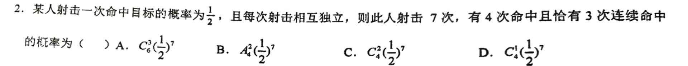

# 

## 第一题

### 繁杂的事件描述

本题学生反映“我没看懂在说什么”，实质上是没看懂“有4次命中且恰有3次连续命中”这句话所描述的事件。

有时候题目中对于事件的描述确实非常繁杂，比如下列事件：
1. 抽检7个样品，其中有不少于4个优品，且不多于1个次品。
2. 两人猜拳，7局4胜制，6局即分出胜负。
3. 两人猜拳，7局4胜制，猜满7局且甲获胜。
4. 麻将桌上，给定一个人目前的牌组，ta下一张牌成功自摸。

如果你会打麻将应该可以想象，实际上第4个事件算是这里面比较复杂的，因为在给定牌组下，自摸胡牌的情况可能相当多。但是一个对数学感到头疼的牌友并不会对第4个事件感到头疼，因为ta很熟悉麻将的规则，摸到任何一张牌，ta都可以判断“是否成功胡牌”。也就是说，“看懂一个事件”仅仅意味着“能够判断任何特定情况是否符合这个事件”，这完全是个语文问题。

我相信脱离了数学的语境，“有4次命中且恰有3次连续命中”这句话对你来说没有什么不能理解的。上课的时候我向你例举了一连串$\surd\times$，你也能够清楚地判断哪个符合哪个不符合。

所以，下次再看到一个繁杂的事件描述，请先忘记它是在数学题中出现的，把它完全当成语文问题，举几个例子试着判断一下，可能很快你就懂了。

$$
\begin{align*}
(1-q)S_n &= \left(\sum_{i=1}^niq^{i}\right)-\left(\sum_{i=2}^{n+1}(i-1)q^{i}\right)\\
     &= \left(1q^1+\sum_{i=2}^niq^{i}\right)-\left(\sum_{i=2}^{n}(i-1)q^{i}+nq^{n+1}\right)\\
&= 1q^1+\left(\sum_{i=2}^niq^{i}-\sum_{i=2}^{n}(i-1)q^{i}\right)-nq^{n+1}\\
&= 1q^1+\left(\sum_{i=2}^n\left(iq^{i}-(i-1)q^{i}\right)\right)-nq^{n+1}\\
&= 1q^1+\left(\sum_{i=2}^nq^{i}\right)-nq^{n+1}\\
&= \left(\sum_{i=1}^nq^{i}\right)-nq^{n+1}\\
\end{align*}
$$