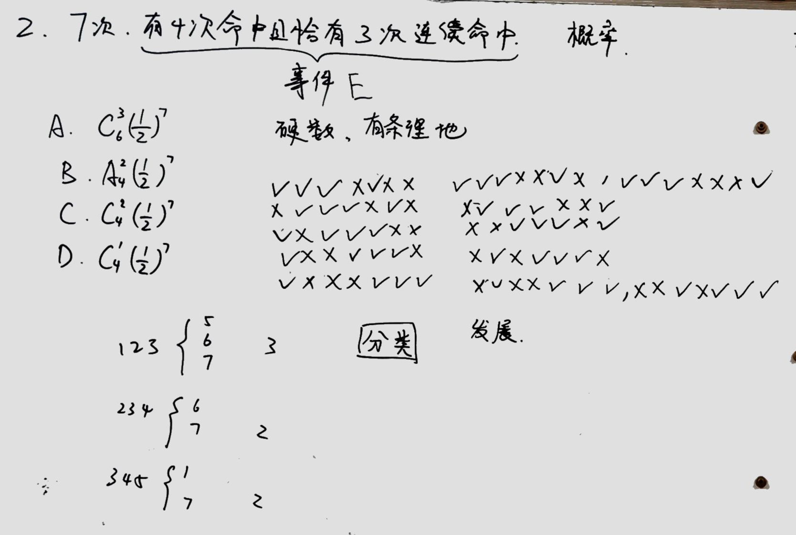
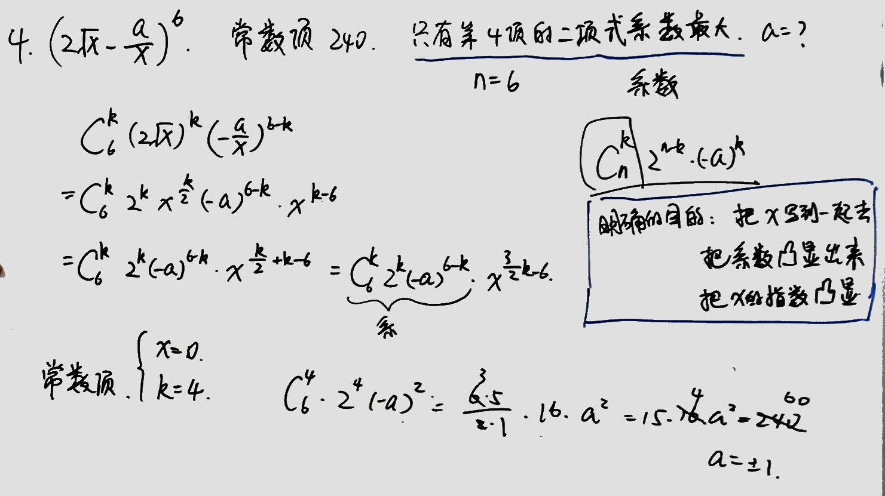
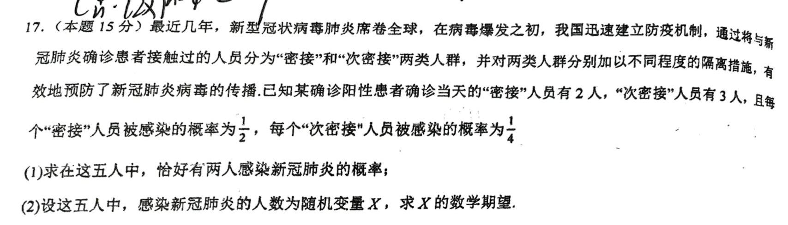
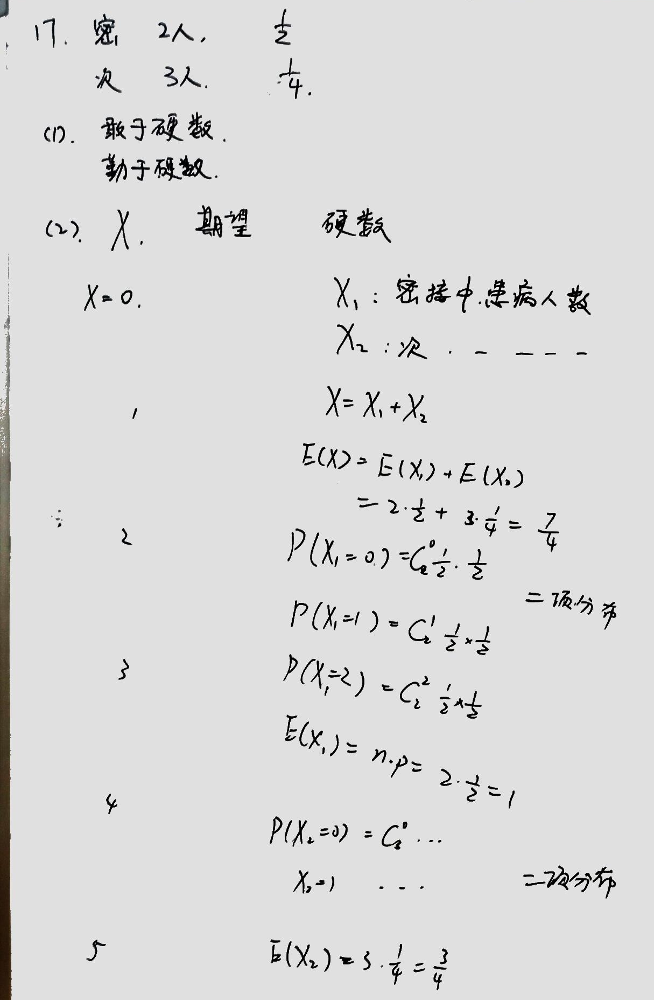
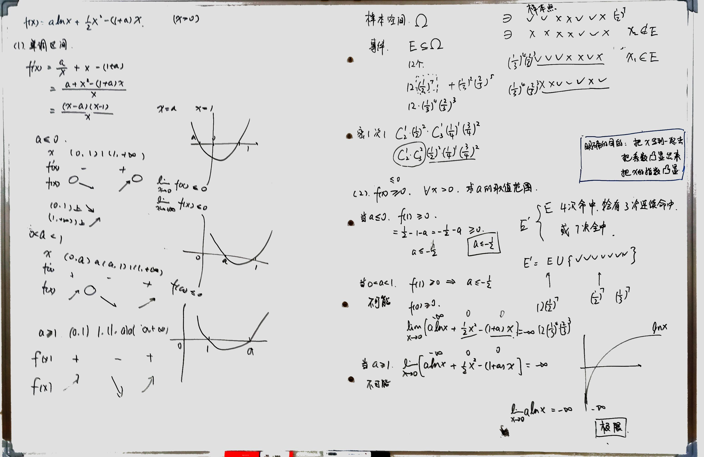

# 有条理地硬数 有条理地将加法简记为乘法

## 第一题

### 繁杂的事件描述

本题学生反映“我没看懂在说什么”，实质上是没看懂“有4次命中且恰有3次连续命中”这句话所描述的事件。

有时候题目中对于事件的描述确实非常繁杂，比如下列事件：
1. 抽检7个样品，其中有不少于4个优品，且不多于1个次品。
2. 两人猜拳，7局4胜制，6局即分出胜负。
3. 两人猜拳，7局4胜制，猜满7局且甲获胜。
4. 麻将桌上，给定一个人目前的牌组，ta下一张牌成功自摸。

如果你会打麻将应该可以想象，实际上第4个事件算是这里面比较复杂的，因为在给定牌组下，自摸胡牌的情况可能相当多。但是一个对数学感到头疼的牌友并不会对第4个事件感到头疼，因为ta很熟悉麻将的规则，摸到任何一张牌，ta都可以判断“是否成功胡牌”。也就是说，“看懂一个事件”仅仅意味着“能够判断任何特定情况是否符合这个事件”，这完全是个语文问题。

我相信脱离了数学的语境，“有4次命中且恰有3次连续命中”这句话对你来说没有什么不能理解的。实际上，上课的时候我向你例举了一连串$\surd\times$，你也能够清楚地判断哪个符合哪个不符合。

所以，下次再看到一个繁杂的事件描述，请先忘记它是在数学题中出现的，把它完全当成语文问题，举几个例子试着判断一下，可能很快你就懂了。

### 样本点、样本空间、事件
课本必修二228-229页写道：
- 在概率问题中，我们把随机试验的每个可能的基本结果称为**样本点**
- 全体样本点的集合称为试验的**样本空间**$\Omega$
- 将样本空间$\Omega$的子集称为**随机事件**，简称**事件**。

这里用子集定义事件，实际上完全符合上面所说的——“看懂一个事件”仅仅意味着“能够判断任何特定情况（样本点）是否符合（属于）这个事件（子集）”。

### 有条理地硬数
当明确这道题不过是要分析事件“有4次命中且恰有3次连续命中”这个子集中有哪些元素后，剩下的工作就是数了。如果没有看出什么简便的方法，就硬数。

硬数的时候，为了不重复也不漏数，最重要的是有条理，而条理有两个要点
- 分类
- 写在演草纸上的排列顺序

本题按照“3个连续的$\surd$放在哪个位置”来分类（这一点你已经意识到了），按照“1个单独的$\surd$从左到右”来排列。请仔细体会其中的考量，并联系到整理书桌时候的强迫症（如果你有整理书桌或者其它任何东西的话）。

### 简便记法
我展示了因为不愿写一大堆$\surd\times$而发明的简便记法，但那不过是参透了本次硬数用到的分类和排列的要义之后的简单工作而已。

这种简便记法是一次性的，换一个题就用不上了，所以我强调它并不是为了说明一种做题技巧，而是想要说明**有条理地硬数的能力是真正重要的基础能力**。

### $(\frac{1}{2})^7$
最后，我改变题中单次射中的概率为$\frac{1}{3}$，那么答案应该变成 $12(\frac{1}{3})^4(\frac{2}{3})^3$。而原答案中的$(\frac{1}{2})^7$本质上是$(\frac{1}{2})^4(\frac{1}{2})^3$。

请理清，这里的本质是——事件$E$中有$12$个样本点，每个样本点附着的概率是$(\frac{1}{3})^4(\frac{2}{3})^3$，虽然这里$\frac{1}{3}$和$\frac{2}{3}$相乘的顺序都不太一样。把这$12$个概率相加得到事件$E$的概率。

## 第二题
题目：$(2\sqrt{x}-\frac{a}{x})^n$展开后的常数项为$240$，且只有第$4$项的二项式系数最大，请求$a$.

### 快速看出$n$
你很清楚二项式系数与系数的区别，所以也能很快意识到，“只有第$4$项的二项式系数最大”基本就告诉你$n$的大小了。只需要举几个例子，就可以看出$n$。

举例子看出$n$说起来很简单，实际做的时候还挺容易出错的。总而言之，$n=6$.

### 展开时要有明确目的
第$k+1$项形如
$$\begin{align*}
&C_6^k(2\sqrt{x})^k\left(-\frac{a}{x}\right)^{6-k}\\
=&C_6^k2^k(-a)^{6-k}x^{\frac{3}{2}k-6}
\end{align*}$$
请体会这个化简过程的**明确目的**
- 把$x$写到一起去
- 把系数凸显出来
- 把$x$的指数凸显出来

## 第三题

### 敢于硬数，勤于硬数
第一问没有技巧，就是硬数，考虑所有可能的情况，分类，并且计算每一类的概率，再相加。

### 分类
将情况分为
- 密接2人，次密接0人
- 密接1人，次密接1人
- 密接0人，次密接2人

这个你是会的。

请额外注意，“恰好有两人患病”是一个事件$E$，而你做的分类就是把集合$E$分为三个互不相交的子集$E_1,E_2,E_3$，每一个类别本身也是一个事件。

### 分类中求概率
你要做的仍然是考虑集合$E_i$中有多少个样本点，以及每个样本点上附着的概率。

- $E_1$中有$C_2^2C_3^0=1$个样本点，其上附着的概率是$\frac{1}{2}\cdot\frac{1}{2}\cdot\frac{3}{4}\cdot\frac{3}{4}\cdot\frac{3}{4}$，所以$E_1$的概率就是这个值。

- $E_2$中有$C_2^1C_3^1$个样本点，每个样本点上附着的概率都是$\frac{1}{2}\cdot\frac{1}{2}\cdot\frac{1}{4}\cdot\frac{3}{4}\cdot\frac{3}{4}$，虽然顺序不同。$E_2$的概率是把它们全部加起来：$C_2^1C_3^1\cdot\frac{1}{2}\cdot\frac{1}{2}\cdot\frac{1}{4}\cdot\frac{3}{4}\cdot\frac{3}{4}$。

- 请你仿照这个造句，描述一下$E_3$的情况。

并注意你的演草中的如下错误
$$C_2^1C_3^1\cdot\frac{1}{2}\cdot\frac{1}{2}\cdot\frac{1}{4}\cdot\frac{3}{4}\cdot\frac{3}{4}  \quad \frac{1}{2}\cdot\frac{1}{2}\cdot\frac{3}{4}\cdot\frac{1}{4}\cdot\frac{3}{4} \quad \frac{1}{2}\cdot\frac{1}{2}\cdot\frac{3}{4}\cdot\frac{3}{4}\cdot\frac{1}{4}
$$
尤其是其中的空格，究竟代表什么？

### 一切都是加法
为了澄清其中的含混，并避免之后再犯，最重要的是明白
- 一切都不过是把样本点上的概率加起来
- 最后将$E_1,E_2,E_3$的概率加起来也只是这个加法通过结合律留到最后计算的两步而已
- 其中出现的乘法只是加法的简记
- 类似这样的式子：$C_2^1(\frac{1}{2})^2C_3^1\frac{1}{4}(\frac{3}{4})^2$，也只是一种简记
- 联系第一题的这个式子理解：$12(\frac{1}{3})^4(\frac{2}{3})^3$

当我说“一切都是加法”的时候，你应该意识到，这和“一切都是从硬数发展起来的”，是一脉相承的。

我不得不承认，真正现实的做题速度要求你必须熟练地使用“乘法简记”等等各种简记。

但是当你使用简记会头脑糊涂、无法判断自己写下的式子对不对的时候，请回到“硬数”“加法”这样的基础步骤。从这一层开始，才能真正明白自己在干什么，才能逐渐熟练灵巧地运用简记法，没有其它捷径。

所以请勤劳地练习将题目退回到基础，也就是勤劳地练习“仿照这个造句，描述一下$E_3$的情况。”。

### 第(2)问继续用硬数来做
我课上介绍的技巧$E(X)=E(X_1)+E(X_2)$，我仔细地翻阅了一下课本，发现课本没讲，不知道课纲有没有讲。

- 这对你来说是个坏消息，因为目前你只能硬数着做第(2)问；
- 这对你来说也是个好消息，因为大部分学生都只能硬数着做第(2)问。

看你怎么理解这件事了。

最后多说一句，实际上你仍然可以通过“一切都是把样本点上的概率加起来”这个想法，证明$E(X)=E(X_1)+E(X_2)$。

## 第四题

之后会讲很多导数和求极限的题，这次我就先不多废话了。只需要注意
- 这个表格工作法
- 使用图像方法判断$(x-a)(x-b)(x-c)(x-d)$这样的多项式的正负
- 看图写话能力，避免对着图像写错成$(0,1)a(1，a)a(a,+\infty)$